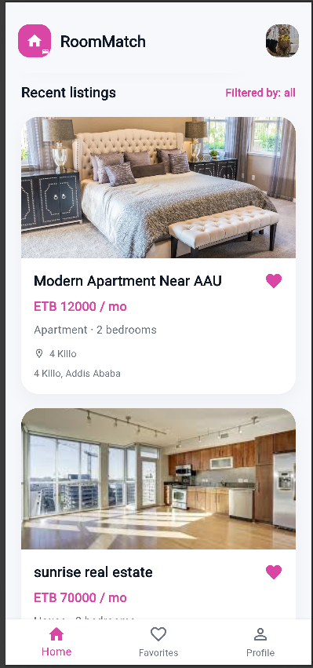
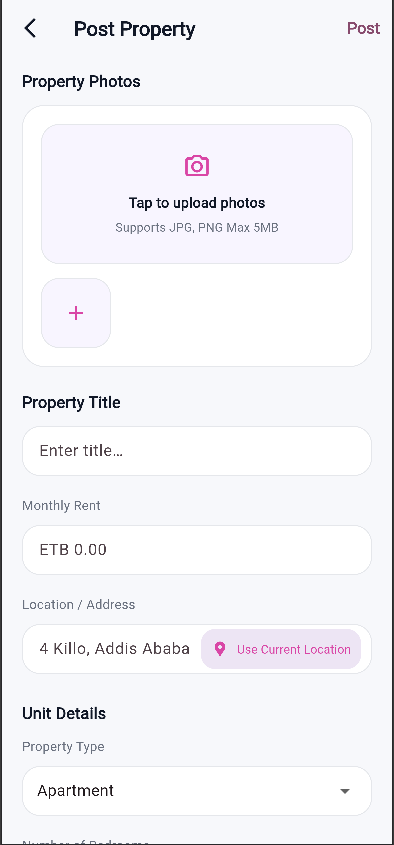

# RoomMatch

RoomMatch is a room rental platform developed using Flutter and Node.js. The system connects property owners with tenants, allowing owners to manage rental listings and tenants to discover suitable rooms and roommates.

---

# Project Team

| No. | Name              | ID          |
| --- | ----------------- | ----------- |
| 1   | BETHEL ASNAKE     | UGR/9526/15 |
| 2   | BETHLEHEM TESFAYE | UGR/4390/15 |
| 3   | DEBORAH TIZAZU    | UGR/7761/15 |
| 4   | FEBEN SOLOMON     | UGR/7274/15 |

---

# Project Overview

RoomMatch provides two user roles:

### Property Owner

Owners can:

- Create rental listings
- Manage profile information
- View all their posted properties

### Tenant

Tenants can:

- Browse available rental properties
- View detailed property information
- Save favorite properties
- Manage profile information
- Contact owners

---

# Screenshots

## 1. Login


## 2. Sign Up


## 3. Tenant Home



## 4. Property Details


## 5. Favorites


## 6. Profile


## 7. Owner Home / My Properties


## 8. Post Property



---

# Technology Stack

### Frontend

- Flutter
- Dart

### Backend

- Node.js
- Express.js

### Database

- JSON File Storage (Local Database)

---

# Project Structure

```text
.
├── client/          # Flutter Application (Web, Mobile, Desktop)
└── server/          # Node.js + Express Backend
```

---

# Features

## Authentication

- User Registration
- User Login
- Role-based Access (Owner / Tenant)

## Property Listings

### Owner and Tenant Features

- Add Listings
- Browse Listings
- View Property Details
- Save Favorite Properties

## Profile Management

- View Profile
- Edit Profile Information
- Update Personal Details

---

# Running the Project

## Backend

```bash
cd server
npm install
npm start
```

Server runs at:

```text
http://localhost:3000
```

---

## Flutter Client

```bash
cd client
flutter pub get
flutter run -d chrome
```

For Android:

```bash
flutter run
```

---

# Documentation

Additional documentation can be found in:

server/README.md – Backend API documentation
client/README.md – Flutter application documentation

---

# License

Academic Project – Addis Ababa University

Department of Computer Science
